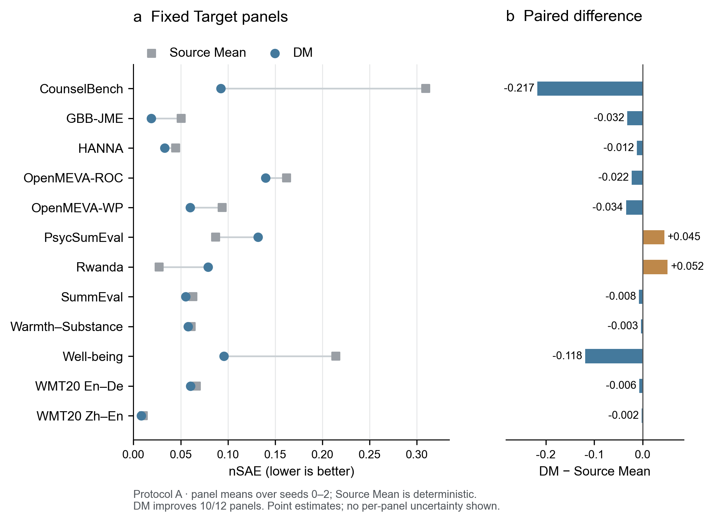

# CCE-Bench

**Reusing Human Scores for Same-Context Responder Evaluation**

[Technical report](paper/technical_report.pdf) · [Experiments](experiments/README.md) · [Code](docs/code.md) · [Results](results/README.md)

CCE-Bench asks whether answers and human scores from earlier responders can help estimate another responder's average score on the same questions. Source answers and scores are available. Target answers are visible, but their scores are withheld from fitting and model selection in the zero-label experiments.

The benchmark covers 12 panels from 11 dataset families. Direct Method (DM) reduces Macro-nSAE from 0.099236 to 0.069394 relative to Source Mean, improving 10 of 12 panels. The report examines residual correction, same-question support, domain adaptation, LLM scoring, and limited Target labels. It also studies why better predictions for individual answers can produce a worse estimate of their average.

## Read the report alongside the code

| Report | Experiment | Repository guide |
|---|---|---|
| Sections 3–4 | Benchmark, label access, and metrics | [Benchmark](docs/benchmark.md), [panels](docs/panels.md), [metrics](docs/metrics.md) |
| Sections 5 and 6.1 | Source Mean, DM, BERT regression, and LLM scoring | [Baselines](experiments/01_baselines/README.md) |
| Section 6.2 | Weighted residuals, DANN, Context, and rubric features | [Extensions and controls](experiments/02_dm_extensions/README.md) |
| Section 6.3 | C* selection, mean-preserving projection, and training objectives | [Mean and row error](experiments/03_error_diagnostics/README.md) |
| Section 7 | Updates with a small Target-label budget | [Limited Target labels](experiments/04_target_labels/README.md) |
| Appendix D | Judge calibration and other exploratory methods | [Supplementary studies](docs/discussion.md) |

The [report guide](docs/report_guide.md) maps individual tables and figures to their data files. Results from different responder splits, score dimensions, and label budgets are kept separate.



*DM improves 10 of 12 panels. Points are means over seeds; the two reversals remain visible.*

## Quick start

Python 3.10 or later is required.

```bash
python -m venv .venv
source .venv/bin/activate
pip install -e ".[dev]"
python examples/quickstart.py
pytest -q
```

The example runs DM, self-normalized importance weighting, residual correction, and judge combination on synthetic data. Optional domain-adaptation components require `pip install -e ".[domain]"`.

The [research source](research/README.md) includes the formal DM, BERT/DANN, and corrected SN-MIPS/SNDR implementations. The quick-start package provides small estimator components; its example does not reproduce the report's fitted models or benchmark scores. [Code and experiment coverage](docs/code.md) describes the implementation of each component and its relationship to the reported experiments.

## Repository layout

```text
paper/          technical report, text, and figures
research/       formal-method implementations and experiment runners
src/ccebench/   reusable components and metrics
examples/       synthetic example
experiments/    experiment designs, results, and code links
methods/        method descriptions
results/        numerical results and dataset definitions
docs/           benchmark and code guides
tests/          component tests
```

## Scope

The findings concern fixed responders answering shared questions. They are retrospective and do not establish performance on unseen questions or independent future responders. SN-MIPS and SNDR include corrections made after earlier result inspection; BERT coefficient zero is a matched auxiliary control. Raw questions, answers, human scores, pretrained models, and fitted checkpoints are not distributed here. Dataset references and scoring rules are given in the report and [panel guide](docs/panels.md).
