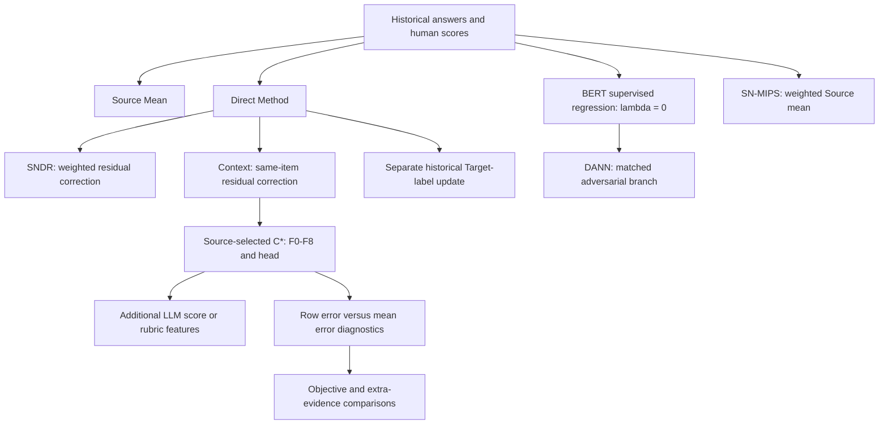

# Method relationships

The methods share Source answers and human scores but use them in different ways. Residual correction extends DM; domain adaptation extends BERT regression; SN-MIPS estimates a weighted Source mean directly.

| Family | Role and method boundary |
|---|---|
| [DM and representations](../methods/01_direct_method/README.md) | Fit Source-supervised outcomes and average Target predictions. Formal DM uses BGE-M3, learned representation, and GBR. BERT and BGE-M3 are representation choices; complete configurations differ in training and validation. |
| [SN-MIPS / project SNDR](../methods/02_ope/README.md) | Weighted Source-score mean or DM correction from weighted OOF Source residuals. OPE-inspired score transfer with visible Target answers; SNDR is not an official OffCEM reproduction. |
| [BERT and DANN](../methods/04_domain_adaptation/README.md) | Compare adversarial training with matched `lambda=0`. Comparing DANN with BGE-M3 DM changes several components and cannot isolate the adversarial increment. |
| [Context](../methods/05_context_bridge/README.md) | Correct DM using same-item support answers, scores, and relations. Human-only underestimation motivated expanded support; insufficient high-score coverage remains a hypothesis. Historical selected gates were constant. |
| [C* and F7](../methods/06_context_calibration/README.md) | C* selects a family/head from Source validation; fixed F7 inspects row structure and mean position. F7 cannot replace the actual selection procedure in performance claims. |
| [LLM routes](../methods/03_llm_judges/README.md) | Direct rubric scores, Context plus LLM-score features, and semantic extensions belong to the four-panel diagnostic. Weighted Judge is a separate calibration branch. J0_CAL is supervised Context-plus-score residual prediction, not one-dimensional calibration or LLM fine-tuning. |

Connections to control variates or prediction-powered estimation do not confer untested unbiasedness or interval-coverage guarantees. Zero-Target-label evaluation and the small-label historical experiment use different information and estimands. No cross-protocol ranking is implied.

The [code guide](code.md) links the formal implementations and smaller examples. [Negative follow-ups](../methods/07_f7_followups/README.md) remain visible alongside the newer mean-error and label-budget diagnostics.
