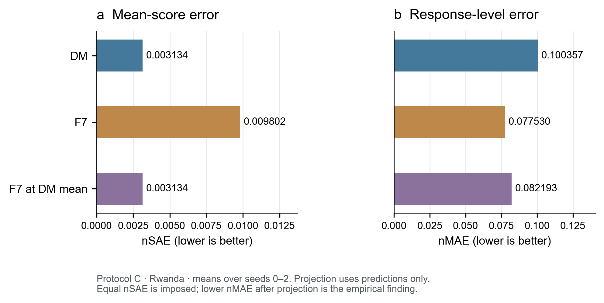
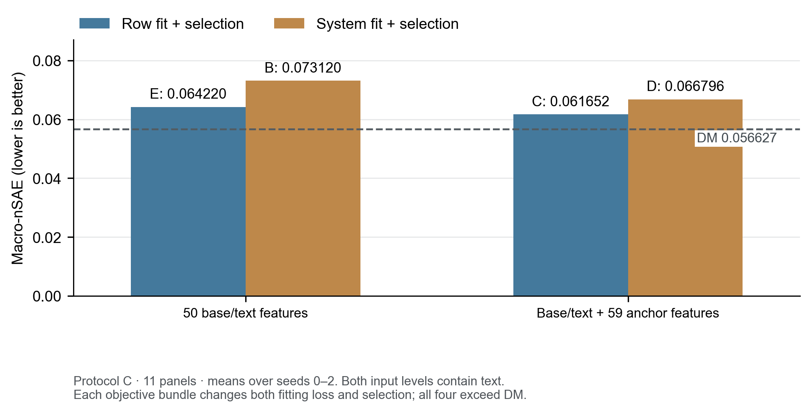

# Abstract

Evaluating each additional language-model responder can require another round of human scoring, even when other responders have already been evaluated on the same questions. We study whether these historical answers and scores can estimate an unscored responder's mean human score. CCE-Bench fixes the task definitions, score scales, retained samples, Target responders, and evaluation rules for 12 panels from 11 dataset families. Source answers and human scores are available; Target answers are visible, while Target scores are excluded from fitting and selection within the documented zero-label runs. On this benchmark, a BGE-M3 Direct Method (DM) reduced Macro-nSAE from 0.099236 for Source Mean to 0.069394 and improved 10 of 12 panels. We then examine designs intended to reduce the remaining error: residual correction, same-question Context, domain adaptation, importance weighting, and LLM-derived information. A matched BERT control did not establish an additional benefit from adversarial training; corrected SNDR did not establish an additional benefit over DM. Separate diagnostics found that adding an LLM score or rubric features did not improve the selected Context configuration. Individual-answer and responder-mean accuracy also diverged. A mean-preserving F7 diagnostic retained useful answer-level structure, but neither Source-only selection nor an 11-panel objective-and-evidence study established a stable improvement in mean transfer. Finally, an independent historical label-budget experiment found a local update benefit for Rwanda, but not CounselBench, and no established advantage of the tested Active strategy over Random. These retrospective findings support conditional reuse of historical human scores, while leaving reliable method selection and mean calibration for independent responders unresolved.

**Keywords:** human evaluation; score transfer; responder evaluation; off-policy evaluation; calibration; benchmark.

# 1. Introduction

Human scoring becomes a repeated expense when many agents answer the same evaluation questions. Each new agent produces a new set of responses to assess, although answers from earlier agents or human respondents may already have been scored. These existing records contain both examples of acceptable performance and information about how a particular rubric is applied. The practical question is whether they can help estimate the average human score of a new agent without obtaining additional scores for that agent. Repeated annotation motivates the study; annotation time was not measured, so the report does not quantify realized time savings.

We formulate this problem as same-context responder score transfer. A Source pool supplies questions, answers, and their human scores. A held-out Target responder supplies answers to the same questions. Its answer text is observable, but its human scores are withheld from model fitting, selection, and calibration in the zero-label setting. The estimand is the Target's mean score on this fixed batch of answers. The term "new responder" describes its label-unavailable role in a split; the experiments do not establish generalization to responders that never informed the wider research process.

An unconditional Source Mean provides a simple starting point, but ignores what the Target actually said. We therefore first test whether supervised prediction from answer content and historical scores improves estimation. Taking DM as a base predictor, we examine residual corrections using weighted Source errors or same-question support. Domain-adversarial training and standalone importance weighting explore parallel approaches. The objective is to lower estimation error; matched controls and ablations test whether the proposed additions achieve that objective and identify which comparisons can support a component claim.

Three research questions organize the report. **RQ1:** Which basic scoring routes estimate the Target mean accurately, and how do supervised predictions compare with a constant Source prior or a direct LLM judge within their respective protocols? **RQ2:** Can designs built around DM, together with parallel adaptation and weighting approaches, further reduce error, and do their proposed components have supported incremental benefits? **RQ3:** Why can individual-answer accuracy improve while mean accuracy worsens, and do selection, mean adjustment, or objective changes resolve the discrepancy? A separate label-budget study then relaxes the zero-label restriction to examine whether a small number of Target scores helps the tested update procedure.

The report contributes a fixed and traceable evaluation framework, a set of empirically tested improvement designs, and diagnostics of their limits. It retains failed variants and panel-specific reversals. The argument is a retrospective organization of completed experiments, not a claim that every branch arose sequentially from the failure of another. It does not establish a universally best new method, clinical benefit, or guarantees for new questions and independent future responders.

# 2. Related work

## 2.1. Supervised score prediction and LLM judges

The Direct Method estimates an outcome using a fitted predictor; it is a familiar component of off-policy evaluation alongside weighting and doubly robust estimators [9]. Here, its prediction target is an observed human rubric score. Our formal DM combines BGE-M3 embeddings [6], a representation transformation learned using Source scores, and a gradient-boosted regressor. The BERT regression branch uses a different pretrained backbone and training pipeline [7]. These references establish the origins of the representations and estimator families. They do not establish that the particular combinations used here are faithful reproductions of a backbone paper's evaluation procedure or that a backbone alone explains a performance difference.

LLM judges offer another scoring route. Work on MT-Bench and Chatbot Arena studies agreement with human judgments and biases in model-based evaluation [10]. In this report, direct rubric scoring, in-context examples with numeric scores, supervised prediction using an LLM score, and LLM-extracted semantic features are distinct information flows. Our four-panel direct judge sees anonymous same-question Source answer texts but not their numeric scores. The supervised extension concatenates its output with Context features and fits a residual predictor using Source human scores. Consequently, its comparison with direct scoring changes more than a one-dimensional calibration function.

## 2.2. Historical evaluation reuse and label-assisted inference

Historical score reuse also appears in CollabEval, which uses evaluation records from anchor models and partial evaluations of Target models to support score reconstruction and inference [1]. Our principal setting instead observes all Target answer texts and uses no Target scores for fitting or calibration. This difference changes both what information is available and what statistical guarantees are justified. Same-question reuse is not, by itself, a novelty claim.

Prediction-powered inference combines predictions with observed labels to correct estimation error [8]. Control Variates Evaluation uses synthetic feedback to assist human-feedback estimates of head-to-head win rates [2]. These approaches distinguish a useful predictor from a mean or comparison estimator whose error is corrected with human observations. Our zero-label prediction mean does not inherit their unbiasedness or interval-coverage properties. The label-budget experiment uses acquired Target scores for residual model updates; it is not a reproduction of either inferential procedure.

## 2.3. Domain adaptation and embedding-based OPE

Domain-adversarial neural networks learn task-predictive representations while discouraging discrimination between Source and Target domains [5]. Their relevance here is the possibility that Source supervision transfers imperfectly to Target answer distributions. This is a hypothesis motivating a design, rather than an established cause of the observed errors. A matched coefficient-zero control is needed to test the adversarial term independently of the rest of the BERT pipeline.

Embedding-based OPE constructs marginalized importance weights in large action spaces [3]. OffCEM combines weighting and modeled effects under its own assumptions [4]. These ideas motivate our self-normalized weighting and residual correction, but the implemented project estimators differ from the original methods. We use **SN-MIPS** for the self-normalized Source score estimator and **SNDR** for the weighted out-of-fold residual correction to DM. SNDR is an OffCEM-inspired project analogue, not official OffCEM. The experiments evaluate prediction of human scores; they do not verify the assumptions needed to identify a clinical policy's causal value.

# 3. Benchmark construction and task

## 3.1. Information contract and estimand

For panel $p$, let $x_i$ be a retained question or context, $a_{is}$ an answer from responder $s$, and $y_{is}$ its released or aggregated human score. The native score scale is $[L_p,U_p]$, with width $R_p=U_p-L_p$. For the fixed Target responder $t$, the estimand is

$$
\mu_{pt}=\frac{1}{N_p}\sum_{i=1}^{N_p}y_{it}.
$$

Available information comprises the eligible Source response-score records and the Target answers on the same retained questions. Some Source answers were written by humans; this answer-generation role is separate from the human rater who supplies the evaluation label. A prediction method may output one score per Target answer, followed by averaging, or directly output a system value. All comparisons require the complete common Target set.

The zero-label execution follows this order: fit and select with permitted Source information; produce all Target predictions or values; freeze them with hashes; then evaluate against the isolated Target scores. Target text access is method-specific: a regressor can process each answer independently, whereas a domain or density model can use the score-free Target batch. Freezing fixes the predictions evaluated under the stated information boundary. It cannot undo earlier inspection of Target-related results during method development.

## 3.2. Fixed panels and retained data

CCE-Bench organizes existing datasets into 12 formal panels spanning 11 registered dataset families. It fixes the primary score dimension, scale endpoints, rating aggregation, retained sample, Source/Target assignment, and evaluation contract. This is benchmark construction from upstream records, not new collection of their annotations. Table 1 summarizes the retained tasks; Appendix A supplies exact responder identifiers, Source composition, aggregation rules, and exclusions.

| Panel | Primary score dimension | Scale | Source records | Target answers |
|:--|:--|:--|--:|--:|
| CounselBench [11] | Overall response quality | 1–5 | 300 | 100 |
| GBB-JME [12] | Released average | 1–10 | 240 | 60 |
| HANNA [13] | Coherence | 1–5 | 960 | 96 |
| OpenMEVA-ROC [14] | Overall story quality | 1–5 | 800 | 200 |
| OpenMEVA-WP [14] | Overall story quality | 1–5 | 800 | 200 |
| PsycSumEval [15] | Main findings | 0–2 | 333 | 111 |
| Rwanda [16] | Medical-consensus alignment | 1–5 | 2,024 | 506 |
| SummEval [17] | Consistency | 1–5 | 1,500 | 100 |
| Warmth–Substance [18] | Clinical accuracy | 1–5 | 378 | 126 |
| Well-being [19] | Effectiveness | 1–7 | 150 | 50 |
| WMT20 En-De [20] | PSQM | 0–6 | 12,483 | 1,387 |
| WMT20 Zh-En [20] | PSQM | 0–6 | 17,874 | 1,986 |
| **Total** | **12 panels** | — | **37,842** | **4,922** |

**Table 1.** Formal-12 retained response-score records. Multiple human ratings can contribute to one record. Counts are reused for seeds 0–2, rather than multiplied into independent observations. The registry counts OpenMEVA-ROC and OpenMEVA-WP within one family. References identify upstream sources; the packaged subset and task definitions are specified by CCE-Bench.

The Source and Target item sets match within each panel. Missing or invalid data are excluded without score imputation, sometimes by deleting a complete question block. Retention therefore need not depend only on the selected primary score. PsycSumEval loses four questions because a secondary field is missing; Rwanda retains 506 of 524 raw questions after its recorded disagreement exclusions. WMT requires complete responder blocks and three valid professional ratings. These rules define the evaluated population and limit extrapolation to excluded records.

Scores retain their original substantive meaning. For example, formal Rwanda fixes Target `deepseek-r1` and `alignment_with_medical_consensus`; its historical `overall11` composite is a different outcome. Scale normalization permits dimensionless error comparisons, but does not make legal, story, summary, medical, well-being, and translation scores a common measure of utility. The retained package defines the evaluated population; a complete reconstruction of every upstream raw-data processing step remains outside the available evidence.

# 4. Protocols, metrics, and inference

## 4.1. Separate evidence protocols

| Protocol | Scope and purpose | Required separation |
|:--|:--|:--|
| **A: Formal-12** | One fixed Target per panel; 12 panels; seeds 0–2 for stochastic methods | Common Target answers; method-specific fitting and validation |
| **B: Historical-LOAO** | Three held-out Agents on CounselBench; four on Rwanda | Historical overall/overall11 scores; equal fixed-responder summaries within dataset |
| **C: Source-held-out diagnostics** | Remove the formal Target, then hold out a Source responder | Four medical-related panels for Context/judge diagnostics; a separate 11-panel factor study |
| **D: Judge Calibration** | Independent QA/judge prediction and calibration tasks | Development human labels and RMSE-based results cannot enter the A ranking |
| **Limited-label B extension** | Release selected Target scores at fixed budgets | Evaluate matched remainders and operational MAE; different label access from zero-label A–C |

**Table 2.** Evidence partitions. They provide complementary tests and are never pooled into one leaderboard. The four medical-related panels evaluate different rubrics, not interchangeable clinical outcomes. The 11-panel diagnostic excludes Well-being and contains 4,872 diagnostic Target answers per seed.

The formal methods share an outer responder holdout but not identical internal validation. DM retains a historical 20% Source-row validation split for representation learning. BERT uses one fixed item fold indexed by the seed for validation and the other four for training. Corrected density weighting uses its own strict cross-fitting and nested calibration rules. Source-only selection means no Target labels are used in that execution; it does not imply an identical nested responder-validation procedure or a guarantee of successful transfer.

All conclusions are retrospective. Source Mean, DM, DANN, and the matched BERT control have traceable predictions frozen before their documented evaluation. Corrected SN-MIPS and SNDR explicitly retain post-gold design-correction status, although their correction runner itself excluded Target scores. These statuses are scientifically different and remain visible in the results. An incomplete artifact chain for another method means its comparability is unresolved, not that it was never run.

## 4.2. Mean error and answer-level error

Write $z_i=(y_{it}-L_p)/R_p$ and let $\hat z_i$ be the corresponding normalized prediction. With $e_i=\hat z_i-z_i$,

$$
\mathrm{nSAE}=\left|\frac{1}{N_p}\sum_i e_i\right|,
\qquad
\mathrm{nMAE}=\frac{1}{N_p}\sum_i|e_i|,
$$

$$
\mathrm{nRMSE}=\sqrt{\frac{1}{N_p}\sum_i e_i^2},
\qquad
\mathrm{Bias}=\frac{R_p}{N_p}\sum_i e_i.
$$

SAE is the absolute error of the predicted system mean; nSAE divides it by the native scale width. Positive Bias indicates overestimation. A value-only estimator receives nSAE from $|\hat\mu_{pt}-\mu_{pt}|/R_p$, without manufactured answer-level metrics. Source Mean can have row metrics because it explicitly provides a constant row prediction; SN-MIPS natively provides only a value.

Each metric is first computed within a panel and seed. **Macro-nSAE** averages those errors equally across the 12 panels, then across the applicable seeds. It is not the absolute error after averaging predictions across seeds or pooling signed errors across panels. Historical LOAO summaries first calculate each held-responder/seed metric and then weight responders equally within dataset. Repeated seeds use the same questions and responders and do not create independent new Targets.

## 4.3. Conditional uncertainty

Reported formal contrasts use archived paired cluster sensitivities with 10,000 resamples. Clusters are actual WMT documents, Warmth scenarios, and items elsewhere; draws are shared across methods and seeds and synchronize Source and Target contexts. They retain the sentence-weighted WMT estimand. A shared-context sensitivity additionally handles one identical context across HANNA and OpenMEVA-WP. Main-text formal intervals are nominal 95% intervals, not simultaneous coverage for all comparisons.

Historical Context intervals use 2,000 synchronized question-cluster resamples across fixed responders. The 11-panel factor contrasts use 20,000 paired cluster resamples with a 17-comparison adjustment for secondary contrasts; the primary D-minus-DM contrast retains its unadjusted interval. Limited-label intervals are retrospective question-cluster intervals and are not simultaneously adjusted across every budget. All of these intervals condition on fitted models and the observed panels/responders. They do not include uncertainty from repeating the entire research selection process, collecting new raters, or deploying on a new responder. Appendix C records the different contracts and aggregation caveats.

# 5. Methods and improvement designs

## 5.1. Constant and supervised baselines

**Source Mean** averages all retained Source scores with equal weight per response-score record. It ignores Target content and provides an unconditional score prior. **DM** tests whether content can improve on that prior. The formal configuration encodes questions and answers separately with BGE-M3, applies a Source-score-informed learned projection and Source-fitted PCA, concatenates question, answer, and interaction features, and fits a GradientBoostingRegressor. The resulting 576-dimensional features combine 64 learned and 128 PCA dimensions per text side. The regressor uses 200 trees, depth 3, and learning rate 0.05. Target answer scores are predicted individually and averaged.

**BERT $\lambda=0$** is the supervised auxiliary control for the DANN branch. It uses BERT-base-uncased on question-answer pairs, CLS pooling, and a reward head, with the final two encoder layers trainable. Its Source labels are standardized using training statistics. The domain branch still executes the matched Source/Target batches, but sends zero adversarial gradient into the shared encoder. This preserves its role as a matched control while allowing it to serve as a complete-configuration performance reference.

## 5.2. Weighted estimates and residual correction

DM can have a systematic Target mean error even when individual predictions are useful. One proposed correction estimates Source errors under weights intended to emphasize Target-relevant regions. For Source records $j$, normalized scores $z_j$, and nonnegative density weights $w_j$, SN-MIPS directly computes

$$
\hat\mu^{\mathrm{SN\text{-}MIPS}}_z
=\frac{\sum_j w_jz_j}{\sum_jw_j}.
$$

The corrected formal implementation estimates these weights from a Source-score-informed BGE representation and Source/Target domain discrimination, with strict item cross-fitting and nested Platt calibration. It clips probabilities and odds before self-normalization. Source scores enter the learned representation; Target scores do not. The method outputs a system value, rather than Target row scores.

**SNDR** instead preserves the same-seed frozen DM Target predictions $b_i$ and forms a constant residual correction from out-of-fold (OOF) Source predictions $\hat z_j^{\mathrm{OOF}}$:

$$
c=\frac{\sum_jw_j(z_j-\hat z_j^{\mathrm{OOF}})}{\sum_jw_j},
\qquad
\hat z_i=\operatorname{clip}(b_i+c,0,1).
$$

The final value is the mean of the clipped predictions. Clipping occurs per row, so the final mean is not necessarily the original DM mean plus $c$. The relevant incremental comparison is SNDR versus DM; SN-MIPS versus Source Mean tests a different, standalone weighting route. Neither formula by itself establishes causal identification or a guaranteed correction of Target bias.

## 5.3. Domain-adversarial regression

DANN tests whether encouraging Source/Target representation similarity improves the BERT regression branch. Its domain classifier learns from balanced Source and score-free Target batches, while the shared encoder receives a reversed domain gradient with coefficient $\lambda=0.1$. Reward supervision uses Source scores only. The matched $\lambda=0$ arm uses the same initialization, batch schedules, training/validation indices, and eligible early-stopping rules; the comparison contains 36 paired panel-by-seed cells. The two arms can select different epochs under their shared Source validation criterion. DANN versus the BGE-M3 DM changes multiple design choices and cannot isolate the domain-adversarial term.

## 5.4. Same-question Context and selected feature families

Context targets information discarded by unconditional pooling: other scored answers to the same question and their relationship to the Target answer. In the research motivation, human-only support had sometimes coincided with underprediction, leading to the hypothesis that high-score examples were insufficiently represented. This motivated broader Source-agent support and same-question models. The existing evidence does not independently establish insufficient high-score coverage as the cause.

The Context family learns a residual to a base DM prediction using same-question Source score summaries, support availability, similarity relationships, and related features. The normalized output has the form $\operatorname{clip}(b_i+g_i\hat r_i,0,1)$ when a gate is used. Removing or shuffling the score channel tests its role; comparison with a same-question Agent median tests whether the full model improves on simple available support. Historical Context selections can choose a constant gate, which must be reported as the realized model.

In the four-panel Source-held-out diagnostic, **C\*** denotes the actual Source-only selection procedure over feature families F0–F8 and six Ridge/GBR heads. **F7** denotes a fixed 19-feature family with a head selected within that family. It retains DM, support availability, aggregate score summaries, similarity-weighted summaries and gaps, and length differences, while omitting explicit human/agent-role features. F7 is used for retrospective structural diagnostics; it is not interchangeable with C\*. The letter C in the later factor study is also a different configuration.

## 5.5. LLM scores and rubric features

The medical-related diagnostic uses one `gpt-4.1-mini` judge across CounselBench, PsycSumEval, Rwanda, and Warmth–Substance. **J0_RAW** directly scores the Target answer from its rubric, question, and anonymous Source answer texts; Source numeric scores are omitted. **Context plus LLM score**, archived as **J0_CAL**, retains the feature family and head configuration selected by C\*, appends a normalized LLM score and a missing indicator, and refits a Source-supervised predictor of $y-b$ on the normalized scale. Its Target output is $\operatorname{clip}(b+\hat r,0,1)$. Invalid judge outputs receive a DM fallback and a missing flag; those fallbacks are not valid LLM judgments.

**R0** replays the frozen C\* predictions exactly. **R2** adds fixed LLM-extracted rubric content and relation features to that baseline. Thus J0_RAW tests a direct scoring workflow, J0_CAL tests the combined supervised workflow, and R2 tests an additional semantic feature pathway. Neither supervised extension fine-tunes the LLM, and J0_CAL is not a one-dimensional calibration of J0_RAW.

# 6. Results

## 6.1. RQ1: Basic estimation routes

### Historical supervision improves on the unconditional prior, with reversals

Because Source Mean ignores Target content, we first compared it with the complete supervised pipelines on the common Formal-12 Target sets. DM reduced Macro-nSAE from **0.099236 to 0.069394**, a **30.1%** relative reduction, and improved **10 of 12 panels**. The observed DM-minus-Source-Mean difference was −0.029842, with a paired cluster interval of [−0.036258, −0.021274]. This supports the conditional usefulness of supervised modeling over an unconditional Source prior on the observed benchmark. Both methods use human scores, so this is not an experiment comparing access to human scores against no access.

| Formal configuration | Macro-nSAE | Macro-nMAE | Evidence role |
|:--|--:|--:|:--|
| Source Mean | 0.099236 | 0.193803 | Primary; deterministic |
| BGE-M3 DM | 0.069394 | 0.146491 | Primary |
| BERT $\lambda=0$ | 0.052713 | 0.152289 | Auxiliary matched control |
| DANN $\lambda=0.1$ | 0.052826 | 0.151106 | Primary |
| SN-MIPS | 0.075532 | — | Corrected; post-gold retrospective |
| SNDR | 0.066565 | 0.142200 | Corrected; post-gold retrospective |

**Table 3.** Protocol A, equal-panel averages after seed-level metric calculation. Lower is better. A dash indicates that the native estimator has no answer-level output. The table compares complete observed configurations and preserves the auxiliary-control and correction statuses; it is not an independent confirmatory ranking.

PsycSumEval and Rwanda were counterexamples. Their Source Mean/DM nSAE values were **0.087087/0.132005** and **0.027050/0.078953**, respectively. Figure 1 displays these reversals alongside the other panels. Equal-panel aggregation prevents large translation datasets from dominating by row count, but does not remove task heterogeneity.

{width=96%}

**Figure 1.** Formal-12 nSAE on the same registered Target answers, averaged after computing each seed's metric. Negative DM-minus-Source-Mean differences favor DM. The plot reports descriptive point estimates; no uncertainty is encoded.

BERT $\lambda=0$ had a lower Macro-nSAE point estimate than DM. This establishes a difference between complete supervised configurations, not a backbone-only effect: representation, regressor, training, and internal validation all differ. The control remains an auxiliary control and was not independently validated as a final rule for selecting models for future responders.

### Combining Context with an LLM score does not outperform Context alone

The formal comparisons leave open whether direct model-based scoring is a useful alternative. We examined this in the separate four-panel diagnostic, after excluding the formal Target and holding out a Source responder. J0_RAW, J0_CAL, and C\*/R0 reached Macro-nSAE **0.194542**, **0.059694**, and **0.032194**, respectively.

| Four-panel diagnostic route | Macro-nSAE | Interpretation |
|:--|--:|:--|
| Direct LLM score: J0_RAW | 0.194542 | Rubric-based output; no Source numeric scores in the prompt |
| Context plus LLM score: J0_CAL | 0.059694 | Source-supervised residual regression with concatenated features |
| Context alone: C\*/R0 | 0.032194 | Actual selected Context; no added LLM score |

**Table 4.** Protocol C, four medical-related panels, using the same judge model throughout. These are retrospective point comparisons; separate statistical confirmation of every pair is not claimed. Semantic acceptance of the associated feature-extraction work remained incomplete.

The combined supervised route outperformed raw scoring but did not exceed Context alone. The first contrast changes inputs and prediction procedure together, so its gain cannot be attributed solely to calibration. The second provides no observed gain from adding the LLM score in this configuration. Since J0_RAW omits Source numeric scores, these results do not replace an ICL experiment that supplies both scored answers and their scores as examples. Additional direct and ICL judges were explored, but lack the aligned evidence needed for the formal six-configuration comparison.

## 6.2. RQ2: Do the improvement designs deliver additional gains?

### Matched controls limit adversarial and residual-correction claims

The basic predictors still had mean error, motivating methods that alter representations, reweight historical records, or correct DM residuals. The relevant question is whether an addition improves its own comparable base. Table 5 therefore uses matched contrasts, rather than attributing a cross-architecture difference to one component.

| Protocol A contrast: first minus second | Macro-nSAE difference | Conditional 95% interval |
|:--|--:|:--|
| DANN − BERT $\lambda=0$ | +0.000113 | [−0.002084, +0.002163] |
| SN-MIPS − Source Mean | −0.023704 | [−0.032203, −0.014089] |
| SNDR − DM | −0.002829 | [−0.011218, +0.008446] |

**Table 5.** Paired cluster sensitivities with fixed fitted models; negative differences favor the first method. Intervals are nominal, not simultaneous. Corrected weighting and residual methods remain post-gold retrospective.

DANN and its matched control had almost identical macro point estimates, **0.052826** and **0.052713**. The interval did not establish an incremental adversarial benefit. This is not an equivalence test and does not show that every domain-adaptation approach fails. SN-MIPS improved on Source Mean but remained above DM in Macro-nSAE. In Rwanda its effective sample size was about **5.78%** of the Source sample, indicating concentrated weights. That is a support-fragility warning, not proof that weight concentration caused the observed error. SNDR's small point improvement over DM was not supported as a stable incremental benefit by its interval.

### Correct score pairing matters in Rwanda, but a simple baseline is stronger

Weighted global residuals do not use all available same-question structure. Historical Context instead tested whether scored peer answers help local prediction. Protocol B held out three Agent responders in CounselBench and four in Rwanda, using the historical overall and overall11 rubrics. The controls removed or shuffled support scores while retaining the rest of the supervised pipeline.

| Historical configuration | CounselBench MAE | Rwanda overall11 MAE |
|:--|--:|--:|
| TextDM | 0.547252 | 0.395944 |
| Context | 0.483443 | 0.303285 |
| Context without support scores | 0.479736 | 0.392949 |
| Context with shuffled support scores | 0.484827 | 0.396953 |
| Context without similarity | 0.520336 | 0.309852 |
| Same-question Agent median | 0.977333 | 0.288358 |

**Table 6.** Protocol B native row MAE, averaged equally over the fixed held-out responders and then seeds. Columns have separate tasks and are not pooled. Agent median uses available non-Target Agent scores for each question, excluding the Human responder; it is not a median across raters or responder-wide means.

In Rwanda, removing or shuffling support scores worsened Context, supporting a role for correct answer-score pairing in that pipeline. Nevertheless, Agent median was better than Context: Context-minus-median MAE was +0.014927, with interval [+0.004639, +0.024169]. Useful pairing therefore did not establish that the complex architecture was preferable to simple same-question aggregation.

CounselBench behaved differently. Removing scores yielded **0.479736**, close to Context's **0.483443**, and shuffling yielded **0.484827**; the corresponding paired intervals crossed zero. Removing similarity worsened MAE to **0.520336**. Thus the score-channel result is task-dependent and cannot be generalized into a claim that answer relationships are irrelevant. Removing a Context score feature also does not remove historical supervision from the base DM or residual training labels.

All **21 of 21** selected historical gates were constant; the selected and ConstantGate predictions matched. Consequently, the reported pipeline results do not demonstrate adaptive per-answer gating. This is an exact statement about the realized selection, rather than a statistical equivalence conclusion.

### Added rubric semantics did not improve the selected Context

Same-question score summaries can leave content distinctions unresolved, motivating LLM-extracted rubric features. In protocol C, adding those features as R2 increased Macro-nSAE from **0.032194** for C\*/R0 to **0.063003**; **11 of 12** panel-by-seed cells worsened. Independent medical-semantic acceptance had not passed. The observed extractor, aggregation, and regression combination therefore failed to improve the selected Context. This does not establish that all semantic evidence is unhelpful, nor that successful feature extraction would imply medical validity.

## 6.3. RQ3: Separating row structure, mean location, and selection

### Lower row error does not imply lower mean error

The mixed component results leave a more basic issue: what aspect of prediction is improving? In protocol A, DM had lower Macro-nMAE than DANN (**0.146491 versus 0.151106**) but higher Macro-nSAE (**0.069394 versus 0.052826**). In historical Rwanda, Context reduced row MAE from **0.395944 to 0.303285**, while mean responder SAE increased from **0.138317 to 0.147831**. These are two within-protocol reversals, not commensurate effects to pool.

The distinction follows directly from signed errors. nSAE depends on their mean; nMAE depends on their absolute magnitudes. For one panel and seed,

$$
\frac{1}{N}\sum_i e_i^2
=\bar e^2+\frac{1}{N}\sum_i(e_i-\bar e)^2.
$$

This decomposes squared row error into squared normalized bias and centered error variance. It is not an additive decomposition of MAE. A model can improve the pattern of answer-level predictions while shifting their common mean unfavorably, or achieve a small mean error through cancellation despite larger individual errors.

### Source-only selection itself has Target counterexamples

Before diagnosing a particular feature family, we report the procedure that was actually selected. Across the four medical-related panels, C\* attained Macro-nSAE **0.032194**, versus **0.044758** for DM. Its archived conditional 95% difference interval, **[−0.030581, +0.012425]**, crossed zero, as did the multiplicity-adjusted and scenario-cluster sensitivities. C\* improved two panels and worsened two (Table 7).

| Protocol C panel | DM nSAE | C\* nSAE | Direction |
|:--|--:|--:|:--|
| CounselBench | 0.065472 | 0.017963 | Improved |
| PsycSumEval | 0.055881 | 0.019328 | Improved |
| Rwanda: consensus alignment | 0.003134 | 0.028520 | Worsened |
| Warmth–Substance | 0.054546 | 0.062965 | Worsened |

**Table 7.** Actual Source-selected C\*, with metrics computed per seed before averaging. The selected feature families were F4 in four cells, F6 in seven, and F7 in one. The table does not substitute the retrospectively highlighted F7 family for C\*.

Rwanda C\* simultaneously improved nMAE from **0.100357 to 0.073765**. It therefore exemplifies both the metric conflict and the limit of Source-only selection. Respecting label isolation does not guarantee a better Target mean than DM. The experiment does not separately identify whether the problem arose from the candidates, the validation criterion, or responder differences.

### Fixing the predicted mean preserves useful F7 row structure

To distinguish row structure from mean location, we examined fixed F7 in the same Rwanda diagnostic. F7 reduced nMAE from **0.100357 to 0.077530** but increased nSAE from **0.003134 to 0.009802**. We then used only the DM and F7 predictions to construct

$$
p_i=\operatorname{clip}(f_i+\tau,0,1),
\qquad
\frac{1}{N}\sum_i p_i=\frac{1}{N}\sum_i b_i,
$$

where $f_i$ and $b_i$ are F7 and DM predictions. The scalar $\tau$ enforces the **DM predicted mean**, not the true Target mean. This clipping-aware constraint is essential: shifting and then clipping without rechecking the mean would not ensure preservation.

| Rwanda diagnostic predictor | nSAE | nMAE |
|:--|--:|--:|
| DM | 0.003134 | 0.100357 |
| Fixed F7 | 0.009802 | 0.077530 |
| F7 at the DM predicted mean | 0.003134 | 0.082193 |

**Table 8.** Protocol C, fixed Rwanda diagnostic responder. The projected predictions were reconstructed without Target gold. Their identical nSAE to DM is imposed by the mean constraint; the empirical result is the retained row-level advantage.

{width=80%}

**Figure 2.** nMAE and nSAE for DM, fixed F7, and F7 projected to the DM predicted mean. Lower values are better in both panels. These point estimates describe a structural diagnostic, not a validated rule for deciding when projection should be applied.

The projection retained lower nMAE than DM, demonstrating useful within-batch prediction structure at the same predicted mean. It added no new information about what the Target mean should be. Neither the cause of the original shift nor a reliable Source-only rule for choosing the projection was established.

### Changing the training/selection objective did not solve mean transfer

The projection result motivates two further possibilities: changing the fitted objective to target responder means, and supplying additional Source evidence. A completed 11-panel diagnostic compared these factors while retaining the uncorrected DM reference. All four variants fitted Ridge residual corrections around the same Source-trained DM. They shared item folds and alpha candidates $\{0.01,0.1,1.0\}$.

The **row-oriented combination** fitted weighted pair-row squared residuals and selected by clipped responder-equal MSE. The **system-oriented combination** fitted responder-mean squared residuals plus 0.1 times row loss and selected by clipped responder-equal nSAE. Both input conditions already contained 50 base/text features; the expanded condition added 59 Source-score, Source-answer-text, and Target–anchor relation features. Corrections were aggregated over anchor pairs, added to DM, and clipped for prediction.

| Input condition | Row-oriented fit/selection | System-oriented fit/selection |
|:--|--:|--:|
| 50 base/text features | E: 0.064220 | B: 0.073120 |
| Base/text plus 59 anchor-evidence features | C: 0.061652 | D: 0.066796 |

**Table 9.** Protocol C, 11-panel Macro-nSAE. The uncorrected **DM reference is 0.056627**. C here is `C_SOURCE_ROW`, not Stage1 C\*. Every cell has a higher point estimate than DM. Training uses unclipped pair corrections; selection evaluates clipped predictions.

| Matched contrast | Difference | Adjusted conditional interval |
|:--|--:|:--|
| B − E: system versus row, base/text | +0.008900 | [+0.003232, +0.015356] |
| D − C: system versus row, expanded inputs | +0.005145 | [+0.000847, +0.011177] |
| C − E: added evidence, row-oriented | −0.002568 | [−0.006165, +0.001555] |
| D − B: added evidence, system-oriented | −0.006323 | [−0.011812, +0.001105] |

**Table 10.** Paired contrasts with the archived 17-comparison correction and 20,000 cluster resamples. Differences use unrounded values. Intervals condition on the fixed fitted models, panels, and responders; internal item-fold validation is not an additional independent-responder test.

{width=88%}

**Figure 3.** The implemented row-oriented combinations outperform the corresponding system-oriented combinations, but all four residual variants have higher Macro-nSAE point estimates than the original DM. The dashed reference is essential to interpreting the factor comparison. Bars show point estimates without uncertainty.

At either input level, the implemented system-oriented combination was worse than the row-oriented combination. However, each contrast changes both the training loss and the selection criterion, so it does not isolate a loss effect. Adding anchor evidence improved the two point estimates, but both intervals crossed zero; because the additions mix scores, text, and relations, they do not isolate one information type. Most importantly, even the best variant, **0.061652**, remained above **DM's 0.056627**. D-minus-DM was **+0.010169**, with a separate unadjusted conditional interval **[+0.001514, +0.019703]**. These results do not establish a stable improvement from the tested correction configurations. They also do not establish that every possible mean-oriented objective is unsuitable.

Further F7 dimension reduction, SVR heads, separate mean/shape optimization, TabNet, self-supervision, and semantic Context variants did not establish a general replacement. Their local improvements and failed acceptance conditions remain in the appendix. The unresolved problem is reliable Target mean estimation and selection, rather than a lack of examples in which row prediction can be improved.

# 7. Applicability with limited Target labels

Zero-label results leave uncertain whether modest Target feedback can stabilize prediction. We therefore report a separate completed historical LOAO experiment that released 5%, 10%, 15%, or 18% of Target scores. It used CounselBench overall and Rwanda overall11, a fixed TextDM base, and a Source-selected Ridge residual adapter fitted with the acquired labels. Active acquisition combined a Source pseudo-target error-risk estimate with coverage and exploration; Random used the same label budget. The task here is prediction of remaining answers, not the formal system-mean estimand.

At 18%, the acquired sets contained **18/100** CounselBench answers and **91/506** Rwanda answers. To identify the update effect, the unchanged DM and updated model were evaluated on exactly the same Active-selected remainder. To compare acquisition policies that leave different remainders, operational MAE was defined as

$$
\mathrm{MAE}_{\mathrm{operational}}
=\frac{\sum_{i\notin Q}|\hat y_i-y_i|}{N},
$$

where $Q$ is the queried set and $N$ the original pool size. Queried answers contribute zero error against the supplied gold because they are treated as manually resolved. This metric can change through which answers are removed as well as through improved prediction.

| Dataset | Unchanged DM on Active remainder | Updated model on same remainder | Update difference and 95% interval |
|:--|--:|--:|:--|
| CounselBench | 0.502456 | 0.519406 | +0.016951 [−0.009441, +0.044957] |
| Rwanda overall11 | 0.368224 | 0.353120 | −0.015104 [−0.025732, −0.004678] |

**Table 11.** Native MAE at 18% budget; update difference is updated minus unchanged DM on the identical remaining answers. Differences use unrounded values. The intervals are retrospective and not simultaneously adjusted across budgets.

Rwanda showed a local update benefit at this budget. CounselBench did not establish a benefit and had a worse updated point estimate. Moreover, Active-minus-Random operational MAE was **+0.023218 [−0.016366, +0.059693]** for CounselBench and **+0.017684 [+0.000465, +0.033421]** for Rwanda. The tested Active strategy therefore did not outperform Random; in Rwanda the conditional interval favored Random despite the adapter's benefit on the Active remainder.

The distinction is practical: useful feedback does not imply that the particular query policy obtains greater value than random sampling. Nor does an improvement on unqueried-answer MAE establish that the earlier Target mean-bias problem has been solved. These results assess the implemented update and acquisition procedures on fixed historical responders, not all small-label methods, active learning in general, or actual annotation-time savings.

# 8. Discussion and limitations

**Historical scores can be reused conditionally.** The formal DM improvement over Source Mean supports learning a relationship between answer content and historical human scores. It does not imply uniform benefit: the PsycSumEval and Rwanda reversals are part of the result. The twelve panels differ in rubric, Source support, score distributions, and Target identity. Normalization and macro averaging make a reproducible summary possible, but cannot remove these differences or establish performance on a population of future tasks.

**Improvement designs require their own controls.** The study sought to reduce DM error through residual and Context extensions while testing parallel adaptation and weighting approaches. Some complete pipelines improved on simple references, but those outcomes do not identify every added component as beneficial. DANN requires the matched BERT control; Context requires score-removal, score-shuffling, and simple-aggregation baselines; an LLM-assisted workflow requires the Context-only reference. Preserving these controls prevents a lower headline error from becoming an unsupported mechanism claim.

**Selection and mean calibration remain unresolved.** Source-only rules are necessary for the stated label-isolation contract, but C\* shows that compliance does not guarantee favorable Target performance. The F7 projection demonstrates that useful answer-level structure can survive an unfavorable mean shift. It does not reveal the correct mean or when to trust DM's mean. The factor study further shows that directly emphasizing Source responder means in the tested fit-and-selection combination did not repair Target mean transfer. Candidate design, validation design, and responder heterogeneity remain plausible contributors, rather than separately established causes.

**The inference is conditional and retrospective.** Separating model fitting from final scoring does not make the full research history independent of observed outcomes. Corrected SN-MIPS/SNDR explicitly followed gold access; diagnostics and highlighted F7 analyses are retrospective. Cluster resampling addresses specific dependencies in the retained data while holding fitted models fixed. It does not account for every exploratory comparison, refitting uncertainty, rating uncertainty, or all unobserved dependencies. Missing artifact chains prevent a complete common ranking of every explored method.

**Human scores and semantic features have their own limits.** The outcomes are native rubric scores, not direct clinical outcomes. The four medical-related panels evaluate different objects, and LLM-generated features had not passed the relevant semantic acceptance checks. The task also observes all Target answer texts on previously shared questions. It does not establish generalization to new questions, clinical correctness, patient benefit, or the causal value of a new policy. Upstream licensing and redistribution conditions remain separate from numerical correctness.

**Small-label updates and acquisition need separate validation.** The budget experiment supports a Rwanda-specific update improvement at 18% while retaining the CounselBench counterexample and the stronger Random acquisition comparison. A single local gain cannot justify a general labeling policy. A minimal next validation would freeze the candidate set, Source-only selection rule, and any mean-calibration rule before evaluating a responder that did not participate in design. It should compare DM, matched BERT regression, simple available score baselines, and the selected extension, reporting both nSAE and nMAE. A claim about new questions requires an additional question holdout rather than more seeds on the same questions.

# 9. Conclusion

CCE-Bench makes same-context responder score transfer explicit through fixed tasks, Source/Target information rules, prediction freezing, and separate mean and answer-level metrics. Historical-score-supervised DM improves average mean estimation over Source Mean on the formal benchmark, with important panel reversals. Proposed residual, Context, adversarial, weighting, and LLM-information extensions have heterogeneous outcomes, and several additions lack an established independent benefit. Row accuracy, mean accuracy, and Source-only selection reliability must therefore be evaluated separately. Limited Target labels can help the tested updater locally, but neither stable cross-task gains nor an Active advantage was established. Reliable mean estimation for independent responders remains the central open problem.

# Data, code, and reproducibility

The appendix documents task definitions, model configurations, statistical procedures, and negative follow-ups. This repository provides the [benchmark specification](../docs/benchmark.md), [code overview](../docs/code.md), [experiment descriptions](../experiments/README.md), [aggregate results](../results/README.md), and report figures. The [formal research implementations](../research/README.md) and smaller reference components support code inspection and reuse; the required prepared data, configurations, frozen inputs, model snapshots, and evaluator are not bundled, so they do not provide a complete replay of every historical training run. The results remain retrospective, and the repository does not redistribute the complete upstream datasets, per-answer predictions, or model checkpoints. Upstream reconstruction, independent-responder validation, and independent semantic acceptance remain incomplete; access to original datasets and model-generated answers is subject to their respective redistribution conditions.

# References

[1] Fisch, A., Deutsch, D., Maynez, J., Agarwal, A., Berant, J., Cohen, W., Globerson, A., and Eisenstein, J. (2026). [CollabEval: Statistically Efficient Collaborative Model Evaluation via Matrix Completion](https://arxiv.org/abs/2607.05046v1). arXiv:2607.05046, version 1. Preprint.

[2] Zhou, Z., Song, Y., and Zanette, A. (2025). [Accelerating Unbiased LLM Evaluation via Synthetic Feedback](https://proceedings.mlr.press/v267/zhou25v.html). ICML, PMLR 267, 79150–79167.

[3] Saito, Y., and Joachims, T. (2022). [Off-Policy Evaluation for Large Action Spaces via Embeddings](https://proceedings.mlr.press/v162/saito22a.html). ICML, PMLR 162, 19089–19122.

[4] Saito, Y., Ren, Q., and Joachims, T. (2023). [Off-Policy Evaluation for Large Action Spaces via Conjunct Effect Modeling](https://proceedings.mlr.press/v202/saito23b.html). ICML, PMLR 202, 29734–29759.

[5] Ganin, Y., Ustinova, E., Ajakan, H., Germain, P., Larochelle, H., Laviolette, F., Marchand, M., and Lempitsky, V. (2016). [Domain-Adversarial Training of Neural Networks](https://www.jmlr.org/papers/v17/15-239.html). Journal of Machine Learning Research, 17(59), 1–35.

[6] Chen, J., Xiao, S., Zhang, P., Luo, K., Lian, D., and Liu, Z. (2024). [M3-Embedding: Multi-Linguality, Multi-Functionality, Multi-Granularity Text Embeddings Through Self-Knowledge Distillation](https://aclanthology.org/2024.findings-acl.137/). Findings of ACL, 2318–2335. DOI: 10.18653/v1/2024.findings-acl.137.

[7] Devlin, J., Chang, M.-W., Lee, K., and Toutanova, K. (2019). [BERT: Pre-training of Deep Bidirectional Transformers for Language Understanding](https://aclanthology.org/N19-1423/). NAACL-HLT, 4171–4186. DOI: 10.18653/v1/N19-1423.

[8] Angelopoulos, A. N., Bates, S., Fannjiang, C., Jordan, M. I., and Zrnic, T. (2023). [Prediction-powered inference](https://doi.org/10.1126/science.adi6000). Science, 382(6671), 669–674.

[9] Dudík, M., Langford, J., and Li, L. (2011). [Doubly Robust Policy Evaluation and Learning](https://arxiv.org/abs/1103.4601). ICML. Author manuscript: arXiv:1103.4601.

[10] Zheng, L., et al. (2023). [Judging LLM-as-a-Judge with MT-Bench and Chatbot Arena](https://proceedings.neurips.cc/paper_files/paper/2023/hash/91f18a1287b398d378ef22505bf41832-Abstract-Datasets_and_Benchmarks.html). Advances in Neural Information Processing Systems, 36, 46595–46623. DOI: 10.52202/075280-2020.

[11] Li, Y., Yao, J., Bunyi, J., Frank, A., Hwang, A., and Liu, R. (2026). [CounselBench: A Large-Scale Expert Evaluation and Adversarial Benchmarking of Large Language Models in Mental Health Question Answering](https://proceedings.iclr.cc/paper_files/paper/2026/hash/99946cb64d51ead9d3969db0af65ca2e-Abstract-Conference.html). ICLR.

[12] Chlapanis, O. S., Galanis, D., Aletras, N., and Androutsopoulos, I. (2025). [GreekBarBench: A Challenging Benchmark for Free-Text Legal Reasoning and Citations](https://aclanthology.org/2025.findings-emnlp.1368/). Findings of EMNLP, 25099–25119. DOI: 10.18653/v1/2025.findings-emnlp.1368.

[13] Chhun, C., Colombo, P., Suchanek, F., and Clavel, C. (2022). [Of Human Criteria and Automatic Metrics: A Benchmark of the Evaluation of Story Generation](https://aclanthology.org/2022.coling-1.509/). COLING, 5794–5836.

[14] Guan, J., Zhang, Z., Feng, Z., Liu, Z., Ding, W., Mao, X., Fan, C., and Huang, M. (2021). [OpenMEVA: A Benchmark for Evaluating Open-ended Story Generation Metrics](https://aclanthology.org/2021.acl-long.500/). ACL-IJCNLP, 6394–6407. DOI: 10.18653/v1/2021.acl-long.500.

[15] Thompson, P., Boulogeorgou, A., Kaponi, F., Soufleri, E., and Ananiadou, S. (2026). [Evaluating Professional Acceptability of LLM-Generated Systematic Review Summaries in Healthcare: Psychiatrists’ Perspectives](https://aclanthology.org/2026.cl4health-1.18/). CL4Health at LREC, 190–206. DOI: 10.63317/4exjqeuaw9ti.

[16] Rutunda, S., et al. (2026). [Large language models for frontline healthcare support in low-resource settings](https://www.nature.com/articles/s44360-025-00038-1). Nature Health, 1, 191–197. DOI: 10.1038/s44360-025-00038-1.

[17] Fabbri, A. R., Kryściński, W., McCann, B., Xiong, C., Socher, R., and Radev, D. (2021). [SummEval: Re-evaluating Summarization Evaluation](https://aclanthology.org/2021.tacl-1.24/). Transactions of the Association for Computational Linguistics, 9, 391–409. DOI: 10.1162/tacl_a_00373.

[18] Ariel, D., et al. (2026). [Asymmetry between warmth and clinical substance in multilingual consumer health AI](https://www.medrxiv.org/content/10.64898/2026.05.09.26352813v1.full). medRxiv, version 1. Preprint. Corresponding [data and analysis release, version 1.0.0](https://zenodo.org/records/20100654), DOI: 10.5281/zenodo.20100654.

[19] Kumar, H., Chahal, J., Zhao, Y., Zhang, Z., Wei, A. Z., Tay, L., and Anderson, A. (2026). [When AI Gives Advice: Evaluating AI and Human Responses to Online Advice-Seeking for Well-Being](https://doi.org/10.1145/3772318.3791233). CHI, 1–20. [Author manuscript](https://arxiv.org/abs/2512.08937).

[20] Freitag, M., Foster, G., Grangier, D., Ratnakar, V., Tan, Q., and Macherey, W. (2021). [Experts, Errors, and Context: A Large-Scale Study of Human Evaluation for Machine Translation](https://aclanthology.org/2021.tacl-1.87/). Transactions of the Association for Computational Linguistics, 9, 1460–1474. DOI: 10.1162/tacl_a_00437. The [original data repository](https://github.com/google/wmt-mqm-human-evaluation) separately provides the pSQM annotations used here.

# Appendix A. Data and protocol definitions

## A.1. The twelve formal panels

Protocol A fixes one Target responder and one native scoring task per panel. Source records contain an input, a response, and an aggregated human score. Target responses to the same inputs are visible; their scores are reserved for evaluation after prediction freezing. Counts below refer to response-score records, not independent raters. The [benchmark specification](../docs/benchmark.md) and [panel metadata](../results/formal_panel_contract.csv) define the listed tasks, scales, Targets, and row counts.

| Panel | Primary score | Scale | Source rows | Target rows | Source machine/human responders |
|---|---|---:|---:|---:|---:|
| CounselBench | overall | 1–5 | 300 | 100 | 2/1 |
| GBB-JME | avg | 1–10 | 240 | 60 | 4/0 |
| HANNA | coherence | 1–5 | 960 | 96 | 9/1 |
| OpenMEVA-ROC | overall | 1–5 | 800 | 200 | 4/0 |
| OpenMEVA-WP | overall | 1–5 | 800 | 200 | 4/0 |
| PsycSumEval | main_findings | 0–2 | 333 | 111 | 3/0 |
| Rwanda | alignment_with_medical_consensus | 1–5 | 2,024 | 506 | 3/1 |
| SummEval | consistency | 1–5 | 1,500 | 100 | 15/0 |
| Warmth–Substance | clinical_accuracy | 1–5 | 378 | 126 | 3/0 |
| Well-being | effectiveness | 1–7 | 150 | 50 | 1/2 |
| WMT20 En–De | psqm | 0–6 | 12,483 | 1,387 | 6/3 |
| WMT20 Zh–En | psqm | 0–6 | 17,874 | 1,986 | 7/2 |

The registered Target identifiers are: CounselBench `llama3`; GBB-JME `us.anthropic.claude-3-7-sonnet-20250219-v1:0`; HANNA `GPT-2 (tag)`; both OpenMEVA panels `gpt`; PsycSumEval `Claude Opus`; Rwanda `deepseek-r1`; SummEval `M14`; Warmth–Substance `deepseek`; Well-being `gpt-4o`; WMT20 En–De `Huoshan_Translate.832`; and WMT20 Zh–En `Tencent_Translation.1249`.

The total is 37,842 Source records and 4,922 Target answers in 12 panels from 11 registered dataset families. OpenMEVA contributes two panels. Seeds 0–2 reuse these rows: a complete stochastic arm has 36 panel–seed cells and 14,766 prediction rows, but 4,922 distinct Target keys. Source Mean is deterministic. Human response authors, human reference authors, and human raters have different roles; for example, OpenMEVA's reference story is not an additional scored responder. Well-being includes Study 1 only and explicitly permits one machine plus two human Source responders.

## A.2. Label aggregation, exclusions, and reconstruction limits

| Panel | Retained-score construction |
|---|---|
| CounselBench | Mean of five valid ratings of overall response quality. |
| GBB-JME | Released `avg = mean(facts, articles, analysis)`; all three dimensions and the composite are required. Individual annotator rows are unavailable. |
| HANNA | Mean of three coherence ratings. |
| OpenMEVA-ROC/WP | Mean of five ratings per generated story, separately in each panel. |
| PsycSumEval | Released psychiatrist score for main findings; no artificial rater averaging. |
| Rwanda | Released expert-evaluator mean for `alignmentWithMedicalConsensus`, checked against raw evaluator dictionaries. |
| SummEval | Mean of three expert consistency ratings; crowd ratings are excluded. |
| Warmth–Substance | Mean of two physician ratings of clinical accuracy. |
| Well-being | Mean of all valid assigned 1–7 effectiveness ratings; at least one is required. |
| WMT20 En–De/Zh–En | Mean of exactly three professional-translator pSQM ratings, with nonempty source and response text. |

No missing scores are imputed. Filtering uses complete item blocks and can depend on tasks beyond the selected rubric. Recorded exclusions are one GBB-JME block, four PsycSumEval blocks, 18 Rwanda blocks, 31 WMT20 En–De blocks, and 14 WMT20 Zh–En blocks. Other panels record none. PsycSumEval exclusions include missing `quality_of_evidence` scores, so its 111 items were not selected solely for `main_findings` completeness. Rwanda excludes any nonempty official disagreement dictionary, including those for the otherwise excluded Meditron responder; its 506 items are a subset of 524 released items. See the [benchmark specification](../docs/benchmark.md) for the data-selection rules.

The formal task excludes locally derived cross-dimension composites: Rwanda `overall_11_mean`, Warmth–Substance cross-dimension mean, HANNA six-dimension mean, SummEval four-dimension mean, and PsycSumEval nine-dimension mean. GBB-JME's released `avg` is the explicit registered exception. Historical Rwanda `overall11` belongs to Protocol B and must not be substituted for the formal medical-consensus score. Affine normalization locates each score within its own rubric; it does not create a common clinical utility.

The retained data use unique response keys, finite in-range scores, matching Source/Target item sets and input text, and score-free Target inputs; formal Target identities are excluded from Source. There is one repeated WMT Zh–En response for different inputs, no repeated input–response pair, and one exact shared context between HANNA and OpenMEVA-WP. The package's 128,810 recorded rating entries are heterogeneous records, not independent annotators; GBB-JME contributes one released scalar per response. These properties describe the retained evaluation data, rather than a complete reconstruction from every upstream raw file or unrestricted redistribution permission.

## A.3. Other evidence populations

Historical-LOAO (B) averages over three CounselBench and four Rwanda Agent holdouts, using its historical rubrics. Source-held-out diagnostics (C) first remove the formal Target, then hold out a machine Source responder. Their exact diagnostic Targets are `gemini`, `gemini-2.0-flash-001`, `BertGeneration`, `gpt_kg`, `fusion`, `GPT-4o-mini`, `gpt-4o`, `M23`, `claude`, `gpt-5`, `Tencent_Translation.1520`, and `DeepMind.381`, in the table's panel order. The four-panel subset comprises CounselBench, PsycSumEval, Rwanda, and Warmth–Substance. Well-being supplies baseline outputs only and is excluded from the 11-panel factor experiment. [Diagnostic panel metadata](../results/diagnostic_panel_contract.csv).

Judge Calibration (D) has separate data, development labels, and outcome definitions. The limited-Target-label experiment uses historical LOAO responders and evaluates remaining answers after acquisition. Neither population enters the zero-Target-label formal ranking.

# Appendix B. Actual implementations and selection

## B.1. Formal method catalog

All six configurations use Source scores; none uses Target scores for fitting. Their internal validation and Target-text access differ. [Method information](../results/formal_method_information.csv).

**Source Mean (M1).** The equal-record-weight mean of all retained Source scores supplies a constant response prediction and a system value. It is a global prior, not a same-question mean.

**Direct Method (M3).** BGE-M3 separately encodes questions and answers with mean pooling, L2 normalization, and length 512. A Source-reward-informed 64-dimensional learned projection and Source-only 128-dimensional PCA produce 192-dimensional vectors per side. Concatenating question, answer, and their elementwise product yields 576 features. GradientBoostingRegressor uses 200 trees, depth 3, and learning rate 0.05. The representation uses the historical seeded 20% Source-row validation split. It is not item-disjoint or responder-held-out validation. Target text undergoes transformation and prediction only.

**DANN and BERT λ=0 (M6).** Both use BERT base uncased, paired input up to 512 tokens, CLS pooling, the final two encoder layers unfrozen, and 128-wide reward/domain heads. The reward loss is MSE on Source-train-standardized scores; balanced binary cross-entropy supplies the domain loss. One fixed item fold indexed by seed is validation and the other four train. This is not five independently fitted cross-validation models. DANN uses adversarial weight 0.1. The auxiliary λ=0 control executes the same domain batches but blocks their gradient into the shared encoder. Source validation MSE chooses the epoch from matched eligible epochs; selected epochs can differ. The 36 paired cells share initialization, batch schedules, and validation indices, with the actual adversarial coefficient set separately for each arm. A nominal shared configuration value of 0.1 does not override the control's actual zero-gradient execution. The control remains an auxiliary configuration, even when its point estimate is lowest.

**Corrected SN-MIPS (M13).** Source-reward-informed BGE learned576 features feed logistic density estimation with C=0.1 and nested Platt calibration with C=1. Strict item cross-fitting excludes held-out items throughout representation, PCA, density, and calibration fitting. Domain weights are balanced and mean-one. Probabilities are clipped to [10⁻⁶, 1−10⁻⁶] and odds ratios to [0,20]. The estimate is the self-normalized weighted Source score mean. It emits a system value only and uses the unlabeled Target batch to estimate weights.

**Corrected SNDR (M14).** The exact same-seed frozen DM Target predictions and Source out-of-fold predictions are combined with corrected M13 weights. A weighted Source residual mean shifts every DM prediction; each row is then clipped and the rows are averaged. The final value need not equal an unclipped base mean plus residual correction. This is an OffCEM-inspired project analogue, not an official OffCEM replication.

## B.2. Context and diagnostic programs

Historical Context predicts a residual around TextDM using same-question Source scores, answer similarities, availability, and base predictions. Full Context has 37 features; NoContextRewards has 15 and NoSimilarity 25. Its native prediction is `clip(base + lambda × residual, 1, 5)`. Removing score features does not remove Source supervision from the base model or residual targets. Ablations may select their own Source configurations. The shuffled-score control permutes scores across questions within each Source responder, retains each score multiset, and refits using the main selected configuration. All 21 selected Context fits chose constant gates and exactly matched ConstantGate predictions. [Context comparisons](../results/context_historical_contrasts.csv).

Stage1's C\* selects among F0–F8 and six Ridge/GBR heads using Source validation. It selected F4 in four cells, F6 in seven, and F7 in one. F7 is a fixed 19-feature family with its own Source-selected head, not the actual overall selection rule. Its features retain the base prediction, availability, score summaries, similarity-weighted scores/gaps, and length differences while excluding explicit human/Agent role indicators. J0_CAL refits a supervised residual head on the selected Context features plus an LLM score and missingness indicator; it is neither a one-dimensional calibration of J0_RAW nor LLM fine-tuning.

The 11-panel factor study uses 50 base text/prediction features, with 59 additional scored-anchor and text-relation features in its evidence arms. E/B use the base inputs; C/D add this evidence. E/C use row loss and row-oriented selection; B/D jointly change to a system-loss-plus-0.1-row-loss objective and system-oriented selection. Thus B−E and D−C test the implemented objective-and-selection package, while C−E and D−B add scores, text, and relationship information together. Five item folds rebuild the base with validation items and pseudo-responders excluded; correction training and validation still reuse development responder identities. These are not two levels of responder holdout.

# Appendix C. Statistical procedures and evidence limitations

For native range R = U−L and final row errors eᵢ = ŷᵢ−yᵢ, Bias = mean(eᵢ), SAE = |Bias|, nSAE = SAE/R, nMAE = mean(|eᵢ|)/R, and nRMSE = √mean(eᵢ²)/R. Metrics are calculated within each panel and seed before equal-panel and seed averaging. Raw-rater counts do not weight responses. Absolute seed-level errors are averaged; this differs from evaluating a seed-ensemble prediction. SN-MIPS Bias is its system estimate minus the Target mean, with no invented row-level errors.

For an actual row predictor, mean(e²) = mean(e)² + mean[(e−mean(e))²]. This decomposes squared error, not MAE. F7's clipping-aware projection preserves the final mean of DM predictions, not the unknown Target gold mean. Its equal nSAE is therefore a mathematical constraint; any retained nMAE benefit concerns structure at that fixed prediction mean.

The original formal evaluation uses 10,000 synchronized item bootstrap draws, seed 20260826. Each draw recomputes Source Mean, the SN-MIPS Hájek ratio, and SNDR correction, clipping, and averaging. Learned representations, models, weights, and Source out-of-fold predictions stay fixed. Source and Target contexts and all methods/seeds share the draw. Ten primary pairwise comparisons received archived sign-tail/Holm summaries; these are not established as null-calibrated frequentist p-values.

Additional sensitivities use 10,000 draws, seed 20260913: within-panel multinomial cluster resampling and shared Poisson(1) cluster multipliers. WMT clusters use `metadata.doc` (130 En–De and 155 Zh–En named documents); `doc_id` is reused and is not the correct document identity. Warmth uses 21 scenarios, each containing six language variants. Other panels use item IDs. Poisson multipliers also link the exact HANNA/WP shared context. Variable-size clusters preserve the sentence-weighted estimand rather than weighting documents equally.

| Contrast: first minus second | Point ΔMacro-nSAE | Multinomial 95% interval | Shared-Poisson 95% interval |
|---|---:|---:|---:|
| DM − Source Mean | −0.029842 | [−0.036258, −0.021274] | [−0.036260, −0.021358] |
| DANN − BERT λ=0 | +0.000113 | [−0.002084, +0.002163] | [−0.002077, +0.002131] |
| SN-MIPS − Source Mean | −0.023704 | [−0.032203, −0.014089] | [−0.032479, −0.014311] |
| SNDR − DM | −0.002829 | [−0.011218, +0.008446] | [−0.011236, +0.008552] |

These four intervals are marginal conditional sensitivities, without simultaneous coverage or uncertainty over new responders, refitted models, or the research selection process. Unknown rater and semantic dependence remains. An interval crossing zero does not establish equivalence.

The 11-panel factor analysis retains a separate comparison family: D−DM is the unadjusted primary contrast; 17 other comparisons use Bonferroni coverage 1−0.05/17. Its 20,000-draw document/scenario sensitivity retains that correction even when only seven matched contrasts are displayed. Historical Context, Stage1, F7 follow-ups, and labeling studies retain their own aggregation and multiplicity contracts; their intervals cannot be pooled into one common significance claim.

Predictions for the original formal methods were frozen before their evaluation scores were accessed by the evaluation run. The corrected SN-MIPS and SNDR designs were developed after earlier access to Target outcomes, although their correction runs excluded Target scores from fitting and froze outputs before evaluation. The corrected results therefore remain post-gold retrospective and non-confirmatory. An execution-level separation between fitting and scoring does not establish a research history independent of previously observed outcomes.

# Appendix D. Supplementary branches and negative evidence

The following supplementary results come from completed experiments under their stated protocols. They are retrospective observations and do not provide independent confirmation.

**Weighted Judge.** The weighted judge combines five donor scores with nonnegative weights summing to one, an intercept, and clipping. Its grouped test RMSE is 0.190414 versus 0.192252 for the unweighted baseline, approximately 1% lower. It uses answer-level human calibration labels and separate datasets/dimensions. Earlier 60/20/20 versions include development-label access. These results are not Formal-12 Macro-nSAE or evidence of zero-label calibration. [Judge-calibration results](../results/judge_calibration.csv).

**PairDelta and Masked Responder Bridge.** In historical LOAO, PairDelta/Masked native row MAE is 0.571146/0.576176 on CounselBench and 0.302190/0.314179 on Rwanda. Context scores 0.483443/0.303285, while Rwanda Agent median scores 0.288358. The archival Context−PairDelta Rwanda interval [−0.006130, 0.008406] lies within its ±0.01 practical band. PairDelta's selected rank-loss coefficient was always zero. A strict nested Source-deletion check failed for its reliability-weighted branch; selected main fits did not use that branch, but some NoAnswerText, AgentAnchorsOnly, and Ridge ablations remain exploratory. Masked attention entropy near one and negligible similarity-over-uniform uplift do not substantiate meaningful learned responder attention. [Supplementary method comparisons](../results/supplementary_methods.csv).

**Human-only, SSA, routing, and gates.** Restricted Source support changes the information condition. In the human-only correction-success gate v4 study, both datasets' Source guards selected Level 0, preserving the frozen baseline. High gate discrimination alone did not establish deployment improvement. The SSA branch is a row-aware reliability-gated SSA-inspired Context–auxiliary deferral, not a neural SSA reproduction. It matched Context on CounselBench and had Rwanda MAE 0.300916, versus 0.297306 for expanded scalar shrinkage and 0.288358 for Agent median. Direct multi-expert routing had MAE 0.615969 on CounselBench and 0.297487 on Rwanda: worse than Context on the former, better on the latter, but still worse than Rwanda Agent median. These findings support neither a universal adaptive-routing benefit nor a confirmed cause of mean bias. [SSA, shrinkage, and routing results](../results/supplementary_methods.csv).

**F7 mean/shape optimization and compression.** The 15-method, 180-cell study's combined D variant failed the prespecified ≥5% nSAE-reduction-plus-corrected-interval gate on all four panels. CounselBench's point improvement was 10.36%, but its corrected interval crossed zero; the other changes did not establish improvement. Its 72-comparison family and 391-comparison historical sensitivity do not cover every earlier exploratory choice. In the 1/3/5/9-feature compression study, CounselBench LITE_9 had nSAE 0.013916 versus F7-19's 0.022718, but failed the stable improvement requirement under 124-comparison correction. [Error diagnostics](../experiments/03_error_diagnostics/README.md) and [compression results](../results/f7_followups.csv).

**SVR head replacement.** All four replacement gates failed. SVR/F7 nSAE was 0.040079/0.022718 for CounselBench, 0.026357/0.010382 for PsycSumEval, 0.015336/0.009802 for Rwanda, and 0.060958/0.054953 for Warmth. SVR improved nMAE in the first three panels but worsened it in Warmth. This is a concrete row/system objective mismatch, not a general rejection of SVR. [SVR and F7 results](../results/f7_followups.csv).

**TabNet and self-supervised pretraining.** No Full Context + TabNet panel passed its nSAE gate against the same-input classic head. TabNet searched 24 candidates and the classic pipeline six, so tuning budgets were unequal. The SSL study used random/group masking and a longer-supervised control. One of 16 comparisons against neural NONE passed: PsycSumEval F7_RANDOM nSAE 0.064869 versus NONE 0.156373; classic F7 remained 0.010382. Matching update counts with SUP_LONG does not match FLOPs or wall time, and group masking changes masking difficulty. [SSL comparison](../results/supplementary_methods.csv).

**Semantic features and remaining model families.** R2's archived Macro-nSAE was 0.063003 versus R0/C\* 0.032194, with independent semantic validation incomplete. The failed acceptance result does not show that semantic information lacks value. DeBERTa, KMM, other direct/ICL judges, LoRA, and Skywork Reward remain cataloged explorations pending a complete comparable configuration, panel coverage, frozen predictions or system values, and comparable evaluation. Their available records do not support a complete aligned ranking. [Semantic-feature results](../results/medical_rubric_macro.csv) and [method scope](../docs/code.md).

**Disease shift.** A separate MEDIQA-QA/TREC LiveQA study uses disjoint questions and disease categories on native 1–4 scores. Its archived materials changed after execution, limiting reconstruction of the complete study, although the six files used for modeling remained unchanged. No performance number from this separate protocol supports the present same-context conclusions. See [benchmark scope](../docs/benchmark.md).

# Appendix E. Reproducibility and evidence access

The public repository provides the following material for reading the experiments and inspecting the reported results:

| Material | Public entry point |
|---|---|
| Formal task and data definitions | [Benchmark specification](../docs/benchmark.md) and [panel metadata](../results/formal_panel_contract.csv) |
| Source Mean, DM, and DANN/control | [Code overview](../docs/code.md), [baseline comparisons](../experiments/01_baselines/README.md), and [formal results](../results/formal_12_panel.csv) |
| Corrected weighted estimators | [Method extensions](../experiments/02_dm_extensions/README.md) and [formal matched contrasts](../results/formal_matched_contrasts.csv) |
| Historical Context | [Context results](../results/context_historical.csv) and [paired contrasts](../results/context_historical_contrasts.csv) |
| Source-held-out diagnostics | [Error diagnostics](../experiments/03_error_diagnostics/README.md), [selected candidates](../results/context_stage1_source_selection.csv), and [factor results](../results/diagnostic_factor_macro_metrics.csv) |
| Limited Target labels | [Label-budget experiment](../experiments/04_target_labels/README.md) and [18% budget contrasts](../results/target_labels_B18_contrasts.csv) |
| Additional numerical results | [Result tables](../results/README.md) and [experiment index](../experiments/README.md) |

The repository includes aggregate evidence, formal-method research code, and smaller reference implementations. It does not include every historical training implementation, pretrained asset, checkpoint, or per-answer prediction file. The complete historical Context training-code snapshot is unavailable, so the public implementation should not be treated as an exact reproduction of that run. The reported experiments remain retrospective; independent-responder validation, complete upstream-data reconstruction, and independent semantic validation remain open. Redistribution of upstream data and generated answers depends on the applicable source terms.
